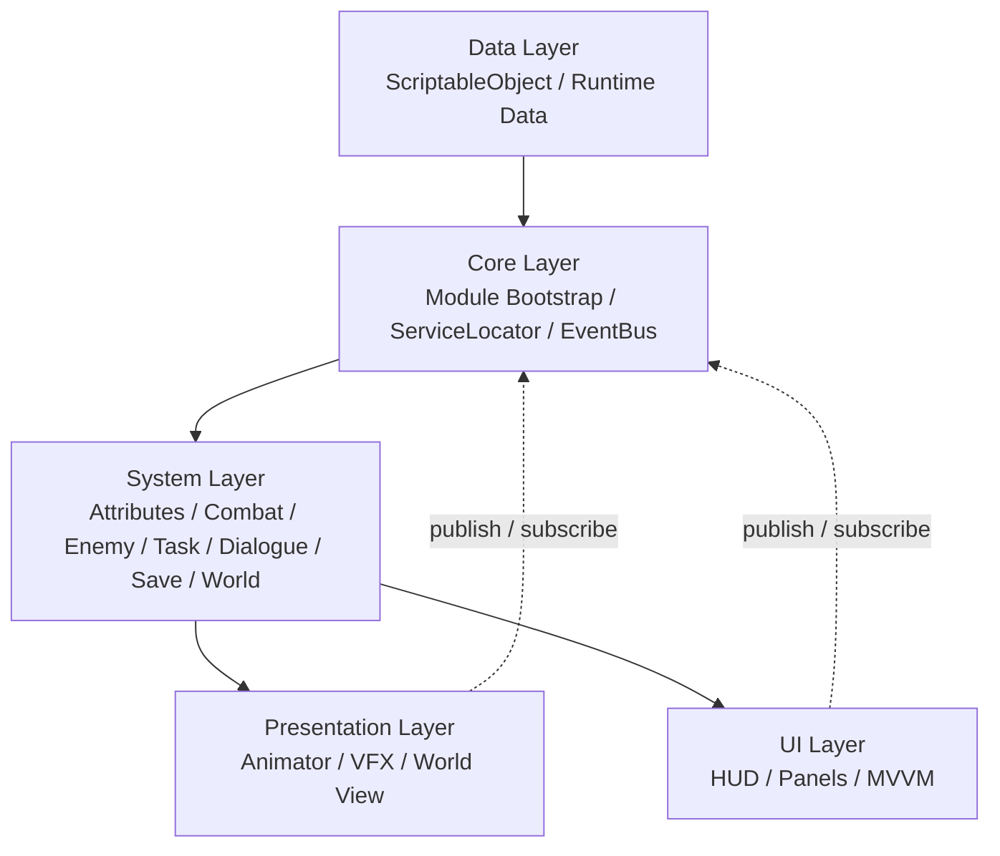

# ARPG

基于 Unity 6 和 C# 开发的模块化动作角色扮演游戏项目。项目重点关注游戏系统的模块拆分、跨模块通信、可配置数据驱动、场景管理、角色动作、敌人 AI、任务/对话/背包系统，以及运行时性能和调试工具。


## 项目特点

- 使用 Assembly Definition 将核心框架、接口、事件和业务模块拆分为独立程序集。
- 使用 `IModuleBootstrap` 统一发现和初始化游戏模块。
- 使用接口、`ServiceLocator` 和泛型 `EventBus<T>` 降低模块之间的直接依赖。
- 按 Data、System、Presentation、UI 组织业务模块，区分配置数据、运行时逻辑和表现层。
- 使用 ScriptableObject 配置角色属性、敌人、物品、武器、任务、对话和音频数据。
- 使用 Unity Addressables、URP、Input System、Kinematic Character Controller 等 Unity 生态组件。

## 已实现功能

### 角色与动作

- 基于 Kinematic Character Controller 实现第三人称角色移动。
- 支持相机相对移动、角色平滑转向、地面移动、斜坡移动、空中移动、重力和跳跃。
- 使用 `Default` / `Combat` 状态组织普通移动和战斗动作。
- 支持单手剑、重剑等武器配置，动作状态由武器类型和 Animator 参数驱动。
- 支持攻击输入缓冲和连击衔接窗口，允许玩家提前输入下一段攻击。
- 将攻击伤害绑定到动画命中窗口，而不是在鼠标点击瞬间结算。
- 通过 `OverlapSphereNonAlloc` 执行水平面扇形攻击检测，并筛选最近的敌对实体。
- 支持受击硬直、死亡状态、武器显隐、攻击中断和动画状态恢复。

### 敌人 AI 与战斗

- 使用行为树组织敌人待机、追踪和攻击逻辑。
- 支持索敌距离、攻击距离、攻击扇形、攻击冷却和视线遮挡检测。
- 敌人攻击时先锁定目标，再在攻击动画命中窗口校验目标状态并结算伤害。
- 战斗模块维护实体生命值、攻击、防御和法力等运行时数据。
- 通过 `EntityHurtEvent`、`EntityDiedEvent` 等事件驱动受击、死亡、血条和任务进度反馈。
- 支持敌人生成规则、运行时实体 ID、任务关联和掉落物配置。

### 任务、对话与世界交互

- 任务系统支持接受任务、进度更新、完成任务、领取奖励和状态恢复。
- 任务可关联敌人击杀、NPC 交互和对话事件。
- 使用 GraphView 实现可视化对话编辑器。
- 对话图支持开始、对白、选项、条件分支、事件和结束节点。
- 运行时通过图遍历引擎处理对话流程，通过变量存储和条件求值支持分支逻辑。
- 编辑器提供起始节点检查、环检测、不可达节点检查和结束节点检查。
- 世界运行时服务维护逻辑世界 ID、场景映射、NPC 注册表和世界标记。

### 背包、属性与成长

- 背包支持物品堆叠、添加、移除、拖拽移动、合并、交换和容量管理。
- 装备系统支持装备/卸下、部位校验、装备属性汇总和装备替换。
- 支持消耗品回血、回蓝和增加经验。
- 支持角色升级、经验成长、角色强化和武器强化。
- 最终属性由基础属性、等级成长、装备修正和强化加成统一计算。
- 使用属性变化事件同步战斗数据和 UI。

### UI、音频与存档

- UI 使用 Static、Dynamic、Overlay 三层 Canvas 管理不同生命周期的界面。
- 封装 `UIView`、`MvvmView`、`ViewModel`、`ObservableProperty` 和 `ReactiveCommand`，支持 MVVM 风格的界面绑定。
- 支持开始菜单、主界面、背包、角色属性、任务、对话和音频设置等界面。
- UI 面板支持通过 Resources 或 Addressables 加载，并由 UI Manager 统一管理生命周期和 Overlay 面板栈。
- 音频系统支持 BGM 配置、异步加载、缓存、淡入淡出和音量持久化。
- 存档系统使用 JSON 保存玩家位置、当前世界、任务状态和世界标记。
- 保存文件先写入临时文件，再替换正式文件，降低写入中断造成存档损坏的风险。

### 调试与编辑器工具

- 运行时调试层支持日志级别过滤、日志分类过滤和日志历史记录。
- 使用环形缓冲区保存最近日志，限制调试数据的持续增长。
- 提供 FPS、帧时间、最小/最大 FPS 和内存统计。
- 提供模块调试抽屉和 Unity Editor 调试控制台。
- 提供 LOD Group 批量修改工具，支持场景对象和 Prefab 批量处理。

## 架构设计



### 模块初始化

游戏启动时由 `GameBootstrap` 调用 `ModuleRegistry.DiscoverModules()`：

1. 扫描已加载程序集中的 `IModuleBootstrap` 实现。
2. 实例化各模块入口。
3. 按模块 `Priority` 排序。
4. 依次调用 `Init()` 注册系统服务。

模块通常包含以下目录：

```text
Modules/<ModuleName>/
  Data/          配置数据和运行时数据
  System/        业务逻辑和服务实现
  Presentation/  世界空间表现、动画和特效
  UI/            屏幕空间界面
```

### 跨模块通信

- 系统级服务通过接口定义，例如 `ICombatService`、`IInventoryService`、`ISaveService`。
- 服务由对应 Bootstrap 注册到 `ServiceLocator`，调用方只依赖接口。
- 事件使用 `EventBus<T>` 广播，事件数据使用 struct，减少消息传递过程中的临时对象。
- `AutoEventView` 负责 View/UI 的事件订阅和生命周期退订。

典型战斗数据流：

```text
玩家输入
  -> 攻击动画命中窗口
  -> MeleeAttackScanner 扇形检测
  -> PlayerAttackEvent
  -> CombatSystem 计算伤害
  -> EntityHurtEvent / EntityDiedEvent
  -> 敌人表现、血条、任务进度和调试日志
```

## 场景与性能优化

### Bootstrap 与世界场景分离

Bootstrap 场景负责全局服务、开始菜单和启动相机，游戏世界通过逻辑世界 ID 映射到实际场景。世界切换时卸载旧场景，再通过 Additive 模式加载新场景；玩家运行时对象、世界服务和任务状态可以跨场景保留。

### 植被分块激活

`VegetationChunkStreaming` 在启动时缓存植被块的 Renderer Bounds，根据摄像机距离启用或禁用远近植被。系统使用滞回距离避免边界抖动，并限制每帧最多处理的状态变化数量，降低批量 `SetActive` 带来的主线程尖峰。

### 敌人 AI 分帧调度

`EnemyAIScheduler` 统一管理敌人 AI Tick，通过轮询方式将感知和行为树更新分摊到不同帧执行，并设置单帧最大 Tick 数。这样可以避免敌人数量增加时所有 AI 同时计算造成的帧时间尖峰。

### 对象池与 NonAlloc 检测

- 敌人血条使用预热对象池，敌人死亡后回收复用。
- 血条对象池统一转发受击和死亡事件，减少重复订阅。
- 近战攻击检测使用 `Physics.OverlapSphereNonAlloc` 和共享碰撞体缓冲区，减少攻击过程中的 GC 分配。
- 战斗演示模块额外提供士兵和编队对象池，用于批量单位战斗场景。

### 相机与渲染状态

场景流转时统一切换启动相机、游戏相机、AudioListener 和 URP Camera Stack，保证同一时刻只有一个有效的主相机和音频监听器，避免重复渲染、双 AudioListener 以及 UI Overlay Camera 丢失。

## 技术栈

| 类别 | 技术 |
| --- | --- |
| 引擎 | Unity 6000.0.28f1c1 |
| 语言 | C# |
| 渲染 | URP |
| 资源管理 | Addressables、Resources |
| 输入 | Unity Input System，部分角色输入适配仍使用 Unity legacy Input API |
| 角色运动 | Kinematic Character Controller |
| UI | Unity uGUI、TextMeshPro、MVVM 风格绑定 |
| 编辑器扩展 | UI Toolkit GraphView、Odin Inspector |
| 动画与表现 | Animator、Animation Event、DOTween、Magica Cloth 2 |
| 性能分析 | Unity Profiler、Memory Profiler、FrameDoctor |

## 运行项目

### 环境要求

- Unity `6000.0.28f1c1`
- Windows Standalone

### 启动步骤

1. 使用 Unity Hub 打开项目根目录。
2. 打开 `Assets/Scenes/Bootstrap.unity`。
3. 点击 Play 进入开始菜单。
4. 点击开始游戏进入世界场景。

也可以运行仓库中已有的 Windows 构建：

```text
ExcuetableFile/ARPG.exe
```

### 基础操作

| 操作 | 按键 |
| --- | --- |
| 移动 | WASD |
| 跳跃 | Space |
| 普通攻击 | 鼠标左键 |
| 相机旋转 | 鼠标移动 |
| 相机缩放 | 鼠标滚轮 / 鼠标右键 |
| 背包 | 由界面快捷键配置 |
| 调试面板 | F3/F4，具体以场景配置为准 |

## 目录结构

```text
Assets/
  Scripts/
    Core/                 模块系统、服务定位器、事件总线、调试基础设施
    Events/               跨模块事件定义
    Interfaces/           服务和实体公共接口
    Modules/              属性、战斗、敌人、背包、任务、对话、存档、世界、UI 等模块
    BattleDemo/           固定逻辑帧和批量单位战斗演示
    Tools/Editor/         LOD 等编辑器工具
  Scenes/                 Bootstrap 和世界场景
  Data/                   配置资产
  Prefabs/                UI、角色和敌人预制体
  Shaders/                自定义 Shader
  Docs/                   架构、存档、对话和场景管理文档
ProjectSettings/          Unity 项目设置
Packages/                 Unity Package 配置
```

## 关键代码入口

| 功能 | 文件 |
| --- | --- |
| 模块初始化 | `Assets/Scripts/Core/Module/ModuleRegistry.cs` |
| 事件总线 | `Assets/Scripts/Core/EventBus/EventBus.cs` |
| 世界场景管理 | `Assets/Scripts/Modules/World/WorldRuntimeService.cs` |
| 植被分块激活 | `Assets/Scripts/Modules/World/VegetationChunkStreaming.cs` |
| 玩家输入适配 | `Assets/Scripts/Modules/Player/PlayerInputAdapter.cs` |
| 玩家动作控制 | `Assets/Plugins/KinematicCharacterController/ExampleCharacter/Scripts/ExampleCharacterController.cs` |
| 近战攻击检测 | `Assets/Scripts/Interfaces/MeleeAttackScanner.cs` |
| 敌人 AI 调度 | `Assets/Scripts/Modules/Enemy/AI/EnemyAIScheduler.cs` |
| 对话运行时 | `Assets/Scripts/Modules/Dialogue/System/DialogueSystem.cs` |
| 对话编辑器 | `Assets/Scripts/Modules/Dialogue/Editor/DialogueGraphEditorWindow.cs` |
| 背包系统 | `Assets/Scripts/Modules/Inventory/System/InventoryManager.cs` |
| 存档系统 | `Assets/Scripts/Modules/Save/System/SaveSystem.cs` |
| UI 管理 | `Assets/Scripts/Modules/UI/Core/UIManager.cs` |
| 调试服务 | `Assets/Scripts/Modules/Debug/System/DebugService.cs` |

## 项目状态与说明

- 项目仍在持续完善，当前重点是系统架构、核心玩法链路和工具化建设。
- `Combat` 模块已经具备实体注册、属性同步、伤害、治疗、法力和战斗事件链路，但技能扩展、复杂战斗效果等内容仍可继续完善。
- 当前音频系统主要完成 BGM、音量控制、淡入淡出和持久化，SFX 播放接口已预留但仍在完善。
- 植被系统目前是场景内的分块激活机制，不是完整的远程资源卸载式流式加载。
- `BattleDemo` 是独立的批量战斗逻辑演示，包含固定逻辑帧、行为树/FSM、逻辑与表现分离及对象池代码；其中部分代码保留了原始 MIT License 版权声明。

## 相关文档

- `Assets/Docs/核心架构思维导图.md`
- `Assets/Docs/MVVM-UI-Architecture.md`
- `Assets/Docs/SaveSystem.md`
- `Assets/Docs/DialogueVisualSystem.md`
- `Assets/Docs/WorldSceneManagementUML.md`
